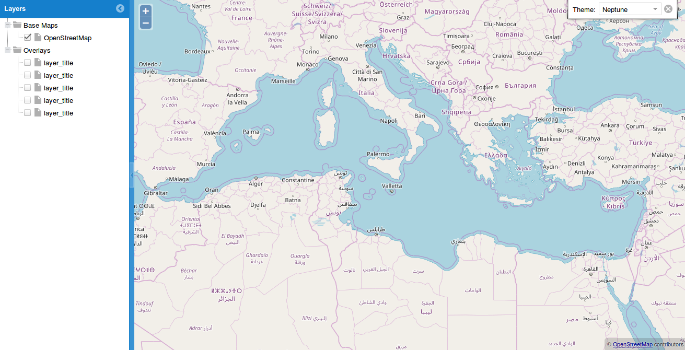

A basic WebGIS Example
========================

This is a basic WebGIS example based on GeoExt 2

How to run it
------------

At first you have to install Apache HTTP web server and git.
To succeed that, in Ubuntu you have to type in a terminal the following command::
    
    $ sudo apt-get install apache2 git

After that, type::
  
    $ cd /var/www/html
    $ sudo git clone https://github.com/Gpetrak/basic_webgis_example

Open a browser and navigate to the following link::

    http://localhost/basic_webgis_example/basic_webgis.html

If all the staff has been built successfully, you should see the webGIS interface:

To visualize layers on the map, you have to install GeoServer and publish your data in there. Follow the link: http://docs.geoserver.org/latest/en/user/ for the instructions.

When you have published your data in GeoServer, take a look in my_map.js file and pay attention to the following pieces of code::
    
    new OpenLayers.Layer.WMS("layer_title",
        "http://localhost:8080/geoserver/wms", {
         layers: "layer_name",
         transparent: true,
         format: "image/png"
         }, {      
            isBaseLayer: false,     
            visibility: false,
            projection:new OpenLayers.Projection("EPSG:900913"),
            buffer: 0
            }
         ),

Replace:
 
layer_title with the title of the layer

layer_name with the layer's name just like it has been stored in GeoServer

Now you should visualize your data on the webGIS example !
